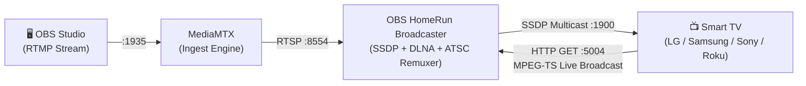

# OBS HomeRun ⚾📺

[](LICENSE)
[](https://github.com/bradwestness/obs-homerun/pkgs/container/obs-homerun)
[](#)

> **Turn your OBS Studio stream into a virtual HDTV tuner for Smart TVs.**  
> Zero TV apps to install. No typing IP addresses in a TV web browser. Works natively on LG webOS, Samsung Tizen, Sony Bravia, and Roku.

---

## 🎯 The Problem

Streaming your PC desktop or gaming session to a living room TV over your local network is notoriously frustrating:
- **No TV Apps Needed:** You shouldn't have to sideload apps, renew developer mode certificates every 50 days (LG webOS), or buy an external Apple TV / Chromecast.
- **No Clunky TV Browsers:** Nobody wants to type `http://192.168.1.xxx:port` with a TV remote.
- **Generic DLNA Servers Fail on Live Feeds:** Media servers like Universal Media Server (UMS), Plex, or Jellyfin are designed for finished movie files on disk. When fed a live OBS feed, they crash with buffer overruns or try to perform byte-range seeks, causing playback to freeze after a few seconds or spin the loading wheel indefinitely.

## 💡 The Solution

**OBS HomeRun** packages a complete live broadcast bridge into a tiny, single container (~60 MB):



1. **Native TV Tuner Emulation:** Announces itself over SSDP (`239.255.255.250:1900`) using the UPnP/DLNA virtual tuner profile.
2. **Instant Native Discovery:** Your TV automatically sees your PC in its **Inputs / Home Dashboard / Devices** list as a TV tuner (Channel 1.1).
3. **Mid-Stream Decoder Lock:** Injects Sequence Parameter Set (SPS) and Picture Parameter Set (PPS) headers inline into every keyframe (`dump_extra`) so the TV's hardware decoder locks on immediately with zero dropped frames.
4. **Universal Broadcast Audio:** Converts audio to ATSC-standard Dolby Digital AC-3 on the fly.
5. **Jitter-Free Playback:** Maintains an internal ~3-second clock cushion (`muxdelay`/`muxpreload`) and expanded TCP buffer so local Wi-Fi micro-stutters never trigger a spinning wheel.
6. **Zero GPU Overhead:** Video is remuxed using stream-copy (0% GPU encode compute taken away from your games or local LLMs).

---

## 🚀 Quick Start

> **Important:** The container **must** use host networking (`--net=host` or `network_mode: host`) so SSDP multicast discovery packets (`239.255.255.250:1900`) can reach your local subnet.

### Option A: Podman Quadlet (Recommended for Bazzite / Fedora Silverblue / SteamOS)

Save as `~/.config/containers/systemd/obs-homerun.container`:

```ini
[Unit]
Description=OBS HomeRun - Virtual HDTV Tuner
After=network-online.target
Wants=network-online.target

[Container]
Image=ghcr.io/bradwestness/obs-homerun:latest
ContainerName=obs-homerun
Network=host
Pull=newer
AutoUpdate=registry
Environment=FRIENDLY_NAME=PC Desktop Livestream
Environment=CHANNEL_NUMBER=1.1
Environment=BUFFER_SECONDS=3.0

[Install]
WantedBy=default.target
```

Reload and start:
```bash
systemctl --user daemon-reload
systemctl --user start obs-homerun.service
```

---

### Option B: Docker Compose

```yaml
services:
  obs-homerun:
    image: ghcr.io/bradwestness/obs-homerun:latest
    container_name: obs-homerun
    network_mode: host
    restart: unless-stopped
    environment:
      - FRIENDLY_NAME=PC Desktop Livestream
      - CHANNEL_NUMBER=1.1
      - BUFFER_SECONDS=3.0
```

Run:
```bash
docker compose up -d
```

---

### Option C: CLI One-Liner

```bash
# Podman
podman run -d --net=host --name obs-homerun ghcr.io/bradwestness/obs-homerun:latest

# Docker
docker run -d --net=host --name obs-homerun ghcr.io/bradwestness/obs-homerun:latest
```

---

## 🎥 OBS Studio Configuration

### 1. Stream Settings
In OBS Studio $\rightarrow$ **Settings** $\rightarrow$ **Stream**:
- **Service:** Custom...
- **Server:** `rtmp://localhost:1935/live`
- **Stream Key:** `stream`

### 2. Output Settings (NVENC / QuickSync / AMF / x264)
In OBS Studio $\rightarrow$ **Settings** $\rightarrow$ **Output** (Output Mode: **Advanced** $\rightarrow$ **Streaming** tab):
- **Rate Control:** `CBR`
- **Bitrate:** `6000 Kbps` (or 8000–12000 Kbps if on 5GHz Wi-Fi / Ethernet)
- **Keyframe Interval:** `1 s` *(Recommended: gives frequent recovery points)*
- **Preset:** P5 / Medium or High Quality
- **Tuning:** High Quality (`hq`)
- **Max B-frames:** `0`

> 💡 **Canvas Framing Tip:** If the edges of your desktop appear clipped on your TV, your capture source scale might be zoomed in. In OBS, click your display capture source in the **Sources** dock and press **`Ctrl + R`** (Reset Transform) or **`Ctrl + F`** (Fit to Screen) to snap it cleanly to your canvas.

---

## 📺 Watching on Your Smart TV

1. Click **Start Streaming** in OBS Studio.
2. Turn on your Smart TV:
   - **LG webOS:** Press **Source / Inputs** or open **Home Dashboard** $\rightarrow$ Select **OBS HomeRun** under Storage/Media Devices $\rightarrow$ Click Channel **1.1**.
   - **Samsung Tizen:** Go to **Connected Devices / Sources** $\rightarrow$ Select **OBS HomeRun**.
   - **Sony Bravia / Android TV / Roku:** Open the native **Media Player** app $\rightarrow$ Select **OBS HomeRun** under DLNA Servers.
3. The stream will lock on within 1–2 seconds with crystal-clear video and audio!

---

## ⚙️ Configuration / Environment Variables

All settings are optional and have sensible defaults:

| Variable | Default | Description |
| :--- | :--- | :--- |
| `FRIENDLY_NAME` | `OBS HomeRun` | Device name shown in the TV Inputs / DLNA list |
| `CHANNEL_NUMBER` | `1.1` | Virtual ATSC channel number |
| `BUFFER_SECONDS` | `3.0` | Jitter cushion buffer duration in seconds (eliminates Wi-Fi stutter) |
| `AUDIO_CODEC` | `ac3` | Audio codec (`ac3` for native ATSC Dolby Digital, or `copy` for passthrough) |
| `AUDIO_BITRATE` | `384k` | Audio bitrate for AC-3 transcode |
| `HTTP_PORT` | `5004` | HTTP port for DLNA & virtual tuner streaming |
| `HOST_IP` | *Auto-detected* | Outbound LAN IP (auto-detected from default gateway if omitted) |
| `RTSP_SOURCE` | `rtsp://127.0.0.1:8554/live/stream` | Internal RTSP feed ingested by MediaMTX |

---

## 🛠️ How It Works Technically

Traditional media servers fail when streaming live desktop video to Smart TVs because:
- **VOD vs Live:** TVs expect live streams to omit `Content-Length` and declare UPnP class `object.item.videoItem.videoBroadcast` with `DLNA.ORG_OP=00` (no seeks).
- **Extradata Missing in Mid-Stream Connections:** Hardware H.264 decoders in modern TVs need SPS and PPS parameter sets at stream initialization. OBS NVENC typically sends these once at stream start. Mid-stream TV connections miss this data unless injected into IDR keyframes.
- **Clock Drift:** Live network streams without demux-decode clock offsets (`muxdelay`/`muxpreload`) leave the TV decoder buffer running at empty ($0\text{s}$ cushion), meaning any brief Wi-Fi ping spike triggers an immediate loading spinner.

OBS HomeRun bridges MediaMTX and FFmpeg bitstream filters to solve all three issues transparently with negligible CPU usage ($< 0.5\%$).

---

## 💤 Resource Usage & On-Demand Execution

OBS HomeRun is designed to run 24/7 as a background service without wasting system resources:

- **Idle (No OBS stream & No TV tuned in):**
  - Consumes **~20 MB RAM** total (Go engine + MediaMTX).
  - Uses **0.0% CPU** and **0% GPU** (passively listening for SSDP discovery and incoming connections).
  - FFmpeg is **not running at all**.
- **OBS Streaming, TV Not Watching:**
  - MediaMTX receives your stream into an internal lightweight socket buffer.
  - FFmpeg is **still not running**—zero transcoding compute is consumed until a TV actively requests the feed.
- **TV Actively Watching:**
  - FFmpeg is spawned on-demand as a child process.
  - Video is remuxed using **stream-copy** (`-c:v copy`), meaning zero GPU encoding power is stolen from your games or local LLMs.
- **TV Turns Off / Changes Inputs:**
  - The HTTP connection terminates and FFmpeg is immediately killed (`SIGKILL`), dropping resource usage back to zero.

---

## ⏪ Live Playback & Seeking (Pause / Rewind)

### Why doesn't the TV let me rewind the stream by default?
In DLNA, streams are flagged with operation capabilities (`DLNA.ORG_OP`). 
- **`DLNA.ORG_OP=00` (Broadcast / Live):** Signals that the feed is an infinite live broadcast without a predefined file length. The TV enters "LIVE" mode.
- **`DLNA.ORG_OP=01` or `10` (Seekable):** Requires a fixed `Content-Length` and static file duration. If advertised on a live feed, the TV attempts to seek to the end or perform byte-range requests, resulting in infinite loading spinners or playback stalls.

Physical hardware tuners work the exact same way—they broadcast a live-only stream with zero internal storage. Any pause/rewind functionality is handled on the **client side**.

### How to enable Pause & Rewind on your TV:
1. **LG Smart TV (Live Playback / Time Machine):**
   - Connect an external USB Hard Drive (or high-speed USB 3.0 SSD) to your LG TV's USB port.
   - When tuned into **OBS HomeRun**, enable **Live Playback** in webOS settings.
   - The TV will maintain a rolling 2-hour buffer locally on the USB drive, allowing you to pause, rewind, and catch back up to live!
2. **Third-Party Tuner Apps (Apple TV, Shield TV, iPad, PC):**
   - Apps like **Channels**, **Plex Live TV**, or **Kodi** can tune directly to `http://<PC-IP>:5004/auto/v1.1`.
   - These apps automatically record a rolling timeshift buffer in client device memory/disk.

---

## 📄 License

MIT © [Brad Westness](LICENSE)
