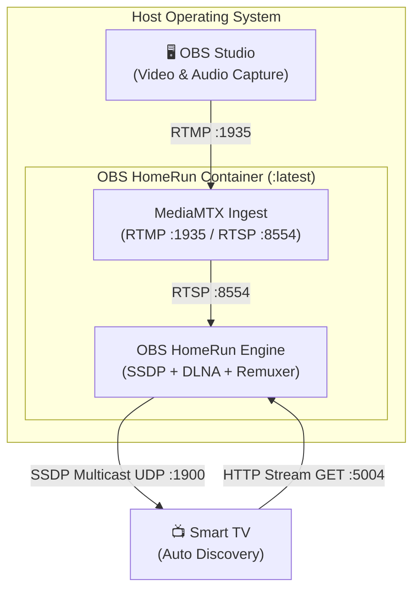

# 🐳 Container Hosting Guide: Linux, Windows, macOS, & NAS

This guide provides end-to-end instructions for deploying **OBS HomeRun** as a container using **Docker** or **Podman** across **Linux (Fedora, Bazzite, Steam Deck, Ubuntu, Debian)**, **Windows 10/11**, **macOS**, and **home NAS servers (Synology, Unraid, TrueNAS SCALE)**.

---

## 💡 Why Container-Only?

OBS HomeRun is packaged and distributed exclusively as an ultra-lightweight (~60 MB), all-in-one container image:  
`ghcr.io/bradwestness/obs-homerun:latest`

By running as a container:
- **Zero manual tool installations:** You never need to install FFmpeg, configure MediaMTX, or compile Rust code.
- **Identical runtime:** The exact same broadcast engine runs identically on your gaming PC, Steam Deck, MacBook, or Synology NAS.
- **Instant updates:** Updating to the newest version is as simple as pulling the latest container image (`docker compose pull` or `podman auto-update`).

---

## 📋 Table of Contents
1. [The Golden Container Rule: Host Networking](#1-the-golden-container-rule-host-networking)
2. [Deployment Topologies](#2-deployment-topologies)
3. [Container Platform Matrix](#3-container-platform-matrix)
4. [🐧 Linux Setup (Podman & Docker)](#4--linux-setup-podman--docker)
   - [⭐ 5-Minute Walkthrough: Podman Quadlet (Fedora / Bazzite / Steam Deck)](#-linux-5-minute-walkthrough-podman-quadlet-fedora--bazzite--steam-deck)
   - [Docker Compose / Docker CLI (`--net=host`)](#docker-compose--docker-cli-net-host)
   - [Linux Firewall & Flatpak OBS Nuances](#linux-firewall--flatpak-obs-nuances)
5. [🪟 Windows Setup (Docker Desktop & Podman)](#5--windows-setup-docker-desktop--podman)
   - [⭐ 5-Minute Walkthrough: Docker Desktop on Windows 11 (WSL2 Mirrored Mode)](#-windows-5-minute-walkthrough-docker-desktop-on-windows-11)
   - [Windows Defender Firewall Setup](#windows-defender-firewall-setup)
   - [Alternative: Streaming from Windows to a Dedicated NAS / Server](#alternative-streaming-from-windows-to-a-dedicated-nas--server)
   - [Windows OBS Studio Settings](#windows-obs-studio-settings)
6. [🍎 macOS Setup (Docker Desktop)](#6--macos-setup-docker-desktop)
   - [⭐ 5-Minute Walkthrough: Docker Desktop on macOS](#-macos-5-minute-walkthrough-docker-desktop-on-macos)
   - [macOS Firewall & Local Network Privacy](#macos-firewall--local-network-privacy)
   - [Alternative: Streaming from Mac to a Dedicated NAS / Server](#alternative-streaming-from-mac-to-a-dedicated-nas--server)
   - [macOS OBS Studio Settings](#macos-obs-studio-settings)
7. [🗄️ Dedicated Home Server & NAS Deployments](#7-️-dedicated-home-server--nas-deployments)
   - [⭐ Synology NAS: Container Manager Point-and-Click Walkthrough](#-synology-nas-container-manager-point-and-click-walkthrough)
   - [Unraid Setup (Docker WebUI)](#unraid-setup-docker-webui)
   - [TrueNAS SCALE Setup](#truenas-scale-setup)
8. [📺 Watching on Your Smart TV](#8--watching-on-your-smart-tv)
9. [🔍 Container Health Checks & Troubleshooting](#9--container-health-checks--troubleshooting)

---

## 1. The Golden Container Rule: Host Networking

To allow Smart TVs (Samsung Tizen, LG webOS, Sony Bravia / Google TV, Roku) to detect your stream automatically without typing IP addresses or installing TV apps, OBS HomeRun broadcasts **SSDP (Simple Service Discovery Protocol)** announcements over **UDP multicast (`239.255.255.250:1900`)**.



### ⚠️ Why Host Networking (`--net=host` / `network_mode: host`) is Required:
Multicast packets are confined to your local Layer 2 broadcast domain.
* **On Linux & NAS:** Host networking connects the container directly to your physical network interface (`eth0` or `wlan0`), allowing SSDP multicast to reach your home network seamlessly.
* **On Windows & macOS:** Standard Docker Desktop runs containers inside a virtualized hypervisor VM (WSL2 on Windows, LinuxKit on macOS). By default, Docker uses a virtual NAT switch that **drops UDP multicast packets**.
  * **On Windows 11:** We easily solve this by enabling **WSL2 Mirrored Networking**, which mirrors your physical Wi-Fi/Ethernet adapter directly into Docker!
  * **On macOS:** Docker Desktop 4.34+ includes host networking support, or you can run the container on a dedicated home server/NAS.

---

## 2. Deployment Topologies

Choose the container setup topology that matches your home environment:

### Topology 1: All-in-One (Container & OBS on Same PC)
OBS Studio and the OBS HomeRun container run on the exact same computer (your gaming PC, desktop, or laptop).
* **Linux:** Run via Podman Quadlet or Docker Compose (`network_mode: host`).
* **Windows 11:** Run via Docker Desktop with WSL2 Mirrored Networking.
* **macOS:** Run via Docker Desktop with host networking.
* **Stream server in OBS:** `rtmp://localhost:1935/live`

### Topology 2: Dedicated Always-On NAS / Home Server (Recommended for Multi-PC Homes)
OBS HomeRun runs 24/7 in a container on your NAS (Synology, TrueNAS, Unraid, QNAP) or a Linux home server / mini-PC / Raspberry Pi.
* Your gaming PC (Windows), workstation (Linux), or MacBook **only runs OBS Studio**.
* Zero containers or services need to run on your gaming rig or laptop.
* **Stream server in OBS:** `rtmp://<NAS-IP>:1935/live` (e.g. `rtmp://192.168.1.50:1935/live`).

---

## 3. Container Platform Matrix

| Host Platform | Container Engine | Host Networking Mechanism | TV Discovery (SSDP) | Recommended Approach |
| :--- | :--- | :--- | :--- | :--- |
| **Linux (Bazzite / SteamOS / Fedora)** | Podman | Native (`--net=host`) | Out-of-the-box | Podman Quadlet systemd service |
| **Linux (Ubuntu / Debian / Arch)** | Docker / Docker Compose | Native (`network_mode: host`) | Out-of-the-box | Docker Compose |
| **Windows 11 (22H2+)** | Docker Desktop (WSL2) | WSL2 Mirrored Mode | Full support via mirrored NIC | Docker Desktop with `.wslconfig` |
| **Windows 10 / Older** | Docker Desktop or NAS | NAS deployment recommended | Routed via NAS | Host container on NAS / home server |
| **macOS (Apple Silicon / Intel)** | Docker Desktop | Docker Desktop host network | Full support on LAN | Docker Desktop or NAS deployment |
| **Synology / TrueNAS / Unraid** | Container Manager / Docker | Native (`network_mode: host`) | Out-of-the-box | Container Manager / WebUI |

---

## 4. 🐧 Linux Setup (Podman & Docker)

Linux provides first-class host networking, making container deployment fast and completely hands-off.

---

### ⭐ Linux: 5-Minute Walkthrough (Podman Quadlet: Fedora / Bazzite / Steam Deck)

If you are gaming on **Bazzite**, **Steam Deck (SteamOS Desktop Mode)**, **Fedora Silverblue**, or any Fedora/RHEL system, Podman Quadlet manages the container declaratively as a native systemd user service with automatic updates.

#### Step 1: Open Terminal
Open **Terminal** (or **Konsole** on Steam Deck Desktop mode).

#### Step 2: Install the Quadlet Service
Copy and paste this single command block into your terminal and press **Enter**:
```bash
mkdir -p ~/.config/containers/systemd
cat << 'EOF' > ~/.config/containers/systemd/obs-homerun.container
[Unit]
Description=OBS HomeRun - Virtual HDTV Tuner
After=network-online.target
Wants=network-online.target

[Container]
Image=ghcr.io/bradwestness/obs-homerun:latest
ContainerName=obs-homerun
Network=host
Pull=newer
AutoUpdate=registry
Environment="FRIENDLY_NAME=OBS HomeRun"
Environment=CHANNEL_NUMBER=1.1
Environment=BUFFER_SECONDS=3.0

[Install]
WantedBy=default.target
EOF

systemctl --user daemon-reload
systemctl --user start obs-homerun.service
loginctl enable-linger $USER
```

#### Step 3: Open Firewall Ports
```bash
# Fedora / Bazzite / RHEL
sudo firewall-cmd --permanent --add-port={1900/udp,5004/tcp,1935/tcp}
sudo firewall-cmd --reload
```

#### Step 4: Configure OBS Studio
1. Open **OBS Studio**.
2. Go to **Settings** $\rightarrow$ **Stream**:
   - **Service:** Select **Custom...**
   - **Server:**
     - Standard OBS: `rtmp://localhost:1935/live`
     - **Flatpak OBS:** If you installed OBS via Flatpak / Software Center, enter your PC's LAN IP (e.g. `rtmp://192.168.1.150:1935/live`) to bypass the Flatpak sandbox.
   - **Stream Key:** `stream`
3. Click **OK**, then click **Start Streaming**!

#### Step 5: Tune in on Your Smart TV
Switch your TV input or open its Media Player $\rightarrow$ Select **OBS HomeRun** (Channel 1.1).

---

### Docker Compose / Docker CLI (`--net=host`)
For Ubuntu, Debian, Arch Linux, or any host with Docker installed:

#### Using Docker Compose:
Save as `docker-compose.yml`:
```yaml
services:
  obs-homerun:
    image: ghcr.io/bradwestness/obs-homerun:latest
    container_name: obs-homerun
    network_mode: host
    restart: unless-stopped
    environment:
      - FRIENDLY_NAME=OBS HomeRun
      - CHANNEL_NUMBER=1.1
      - BUFFER_SECONDS=3.0
```

Start the container:
```bash
docker compose up -d
```

#### Using Docker CLI:
```bash
docker run -d \
  --name obs-homerun \
  --net=host \
  --restart=unless-stopped \
  -e FRIENDLY_NAME="OBS HomeRun" \
  ghcr.io/bradwestness/obs-homerun:latest
```

---

### Linux Firewall & Flatpak OBS Nuances
* **Firewall (`ufw` on Ubuntu / Debian):**
  ```bash
  sudo ufw allow 1900/udp comment "OBS HomeRun SSDP"
  sudo ufw allow 5004/tcp comment "OBS HomeRun DLNA"
  sudo ufw allow 1935/tcp comment "OBS HomeRun RTMP"
  sudo ufw reload
  ```
* **Flatpak OBS Sandbox:** If you run Flatpak OBS and `rtmp://localhost:1935/live` fails with *"Failed to connect"*, set the server in OBS to your computer's LAN IP (e.g. `rtmp://192.168.1.150:1935/live`).

---

## 5. 🪟 Windows Setup (Docker Desktop & Podman)

Run the OBS HomeRun container on Windows 11 using Docker Desktop with full SSDP multicast discovery.

---

### ⭐ Windows: 5-Minute Walkthrough (Docker Desktop on Windows 11)

Follow this step-by-step guide to run the OBS HomeRun container on Windows 11.

#### Step 1: Install Docker Desktop
If you haven't already, install [Docker Desktop for Windows](https://www.docker.com/products/docker-desktop/) (ensure WSL 2 engine is selected during setup).

#### Step 2: Enable WSL2 Mirrored Networking (1-Minute Configuration)
Windows 11 (22H2 or newer) includes **Mirrored Networking**, which allows WSL2 and Docker to directly share your computer's physical network adapter so your Smart TV can see the container.

1. Press **Windows Key + R**, type `%USERPROFILE%`, and click **OK** to open your user folder.
2. Create or edit a file named `.wslconfig` (or copy [`examples/windows/.wslconfig`](file:///home/brad/source/repos/obs-homerun/examples/windows/.wslconfig)):
   ```ini
   [wsl2]
   networkingMode=mirrored
   firewall=true
   ```
3. Open PowerShell and restart WSL:
   ```powershell
   wsl --shutdown
   ```
4. Restart Docker Desktop from your Start menu.

#### Step 3: Run the Container
Open PowerShell and run:
```powershell
docker run -d --name obs-homerun --net=host --restart=unless-stopped ghcr.io/bradwestness/obs-homerun:latest
```

#### Step 4: Allow Windows Defender Firewall
To ensure your TV can talk to the container through Windows Firewall:
1. Open PowerShell as **Administrator**.
2. Run the provided script from `examples/windows/`:
   ```powershell
   powershell -ExecutionPolicy Bypass -File examples\windows\setup-firewall.ps1
   ```
   *(Or copy-paste the three commands in [Windows Defender Firewall Setup](#windows-defender-firewall-setup)).*

#### Step 5: Configure OBS Studio
1. Open **OBS Studio**.
2. Click **Settings** $\rightarrow$ **Stream**:
   - **Service:** `Custom...`
   - **Server:** `rtmp://localhost:1935/live`
   - **Stream Key:** `stream`
3. Click **Output** (Advanced Output Mode $\rightarrow$ Streaming):
   - **Video Encoder:** Select your GPU encoder (`NVIDIA NVENC H.264`, `AMD HW H.264`, or `QuickSync H.264`).
   - **Rate Control:** `CBR`
   - **Bitrate:** `6000 Kbps` (or 8000–12000 Kbps on 5GHz / Ethernet)
   - **Keyframe Interval:** `1 s` *(⚠️ Critical for quick TV lock-on!)*
   - **Max B-frames:** `0`
4. Click **OK**, then click **Start Streaming**!

#### Step 6: Watch on Your Smart TV
Switch your TV input or open its Media Player $\rightarrow$ Select **OBS HomeRun** (Channel 1.1).

---

### Windows Defender Firewall Setup

Run PowerShell as **Administrator**:
```powershell
# Allow SSDP Multicast (Discovery)
New-NetFirewallRule -DisplayName "OBS HomeRun SSDP" -Direction Inbound -Protocol UDP -LocalPort 1900 -Action Allow

# Allow DLNA & Virtual Tuner HTTP Streaming
New-NetFirewallRule -DisplayName "OBS HomeRun DLNA HTTP" -Direction Inbound -Protocol TCP -LocalPort 5004 -Action Allow

# Allow RTMP Ingest from OBS Studio
New-NetFirewallRule -DisplayName "OBS HomeRun RTMP Ingest" -Direction Inbound -Protocol TCP -LocalPort 1935 -Action Allow
```

---

### Alternative: Streaming from Windows to a Dedicated NAS / Server
If you already run a home server or NAS, you do not need Docker on your Windows gaming PC!
1. Run the container on your NAS (see [NAS Setup Guide](#7-️-dedicated-home-server--nas-deployments)).
2. In OBS Studio on your Windows PC $\rightarrow$ **Settings** $\rightarrow$ **Stream**:
   - **Server:** `rtmp://<NAS-IP>:1935/live` (e.g. `rtmp://192.168.1.50:1935/live`)
   - **Stream Key:** `stream`
3. Click **Start Streaming**.

---

### Windows OBS Studio Settings
* **Desktop Video Capture:** Add a **Display Capture** source using **Desktop Duplication (DXGI)** or **Windows Graphics Capture (WGC)**.
* **Audio Capture:** In OBS **Settings** $\rightarrow$ **Audio**, set **Desktop Audio** to your primary audio output and ensure sample rate is **48 kHz**.
* **Ultrawide & HDR:** If using ultrawide monitors (21:9 or 32:9), refer to the [OBS Configuration Guide](obs-configuration.md#ultrawide-monitors-219--329).

---

## 6. 🍎 macOS Setup (Docker Desktop)

Run the OBS HomeRun container on macOS with Docker Desktop.

---

### ⭐ macOS: 5-Minute Walkthrough (Docker Desktop on macOS)

#### Step 1: Install Docker Desktop for Mac
Download and install [Docker Desktop for Mac](https://www.docker.com/products/docker-desktop/) (Apple Silicon or Intel).

#### Step 2: Run the Container with Host Networking
Docker Desktop 4.34+ on macOS supports host networking. Open Terminal and run:
```bash
docker run -d \
  --name obs-homerun \
  --net=host \
  --restart=unless-stopped \
  ghcr.io/bradwestness/obs-homerun:latest
```

#### Step 3: Configure OBS Studio on Mac
1. Open **OBS Studio**.
2. Go to **Settings** $\rightarrow$ **Stream**:
   - **Service:** `Custom...`
   - **Server:** `rtmp://localhost:1935/live`
   - **Stream Key:** `stream`
3. Go to **Settings** $\rightarrow$ **Output** (Advanced Output Mode $\rightarrow$ Streaming):
   - **Video Encoder:** Select **`Apple VT H264 Hardware Encoder`** *(VideoToolbox hardware encode with 0% CPU overhead)*.
   - **Rate Control:** `CBR`
   - **Bitrate:** `6000 Kbps`
   - **Keyframe Interval:** `1 s`
4. Click **OK**, then click **Start Streaming**!

#### Step 4: Watch on Your TV
Switch your TV input or open its Media Player $\rightarrow$ Select **OBS HomeRun** (Channel 1.1).

---

### macOS Firewall & Local Network Privacy
* **Application Firewall:** If enabled in **System Settings** $\rightarrow$ **Network** $\rightarrow$ **Firewall**, ensure Docker is permitted to accept incoming connections.
* **Local Network Privacy (macOS 15 Sequoia / Sonoma):** When prompted, click **Allow** to permit Docker to access devices on your local network.

---

### Alternative: Streaming from Mac to a Dedicated NAS / Server
If you have an always-on NAS or Linux server, run the container there and point OBS Studio on macOS to:
* **Server:** `rtmp://<NAS-IP>:1935/live`
* **Stream Key:** `stream`

---

### macOS OBS Studio Settings
* **Video Encoder:** Select **Apple VT H264 Hardware Encoder**.
* **Display Capture:** In OBS Sources, add a **macOS Screen Capture (ScreenCaptureKit)** source.
* **Audio Capture:** In OBS 29.1+ on macOS 13 (Ventura) or newer, desktop audio is captured natively. In OBS **Settings** $\rightarrow$ **Audio**, set sample rate to **48 kHz**.

---

## 7. 🗄️ Dedicated Home Server & NAS Deployments

Running the OBS HomeRun container on an always-on NAS (Synology, TrueNAS, Unraid) is the most popular choice for home streaming. The broadcaster sits idle 24/7 on your home network without needing any containers or services running on your workstation or gaming PC.

---

### ⭐ Synology NAS: Container Manager Point-and-Click Walkthrough

1. Open your Synology DSM web desktop in your browser.
2. Open **Container Manager** (install it from Package Center if needed).
3. In Container Manager, click **Project** on the left menu $\rightarrow$ click **Create**.
4. Configure project settings:
   - **Project Name:** `obs-homerun`
   - **Path:** Choose any folder (e.g. `/docker/obs-homerun`).
   - **Source:** Select **Create docker-compose.yml**.
5. Paste this configuration:
   ```yaml
   services:
     obs-homerun:
       image: ghcr.io/bradwestness/obs-homerun:latest
       container_name: obs-homerun
       network_mode: host
       restart: unless-stopped
       environment:
         - FRIENDLY_NAME=OBS HomeRun
         - CHANNEL_NUMBER=1.1
         - BUFFER_SECONDS=3.0
   ```
6. Click **Next** $\rightarrow$ **Next** $\rightarrow$ **Done**.
7. In OBS Studio on your PC or Mac, set **Stream Server** to:
   ```
   rtmp://<SYNOLOGY-IP>:1935/live
   ```
   *(e.g. `rtmp://192.168.1.50:1935/live`)*.

---

### Unraid Setup (Docker WebUI)
1. In the Unraid WebGUI $\rightarrow$ click the **Docker** tab $\rightarrow$ click **Add Container** at the bottom.
2. Enter container parameters:
   - **Name:** `obs-homerun`
   - **Repository:** `ghcr.io/bradwestness/obs-homerun:latest`
   - **Network Type:** Select **Host** (`--net=host`).
3. Click **Apply**.

---

### TrueNAS SCALE Setup
1. In the TrueNAS WebGUI $\rightarrow$ **Apps** $\rightarrow$ click **Discover Apps** $\rightarrow$ click **Custom App** (or Launch Docker Image).
2. Configure:
   - **Application Name:** `obs-homerun`
   - **Image repository:** `ghcr.io/bradwestness/obs-homerun`
   - **Image tag:** `latest`
   - **Network Configuration:** Check **Host Network**.
3. Save and start.

---

## 8. 📺 Watching on Your Smart TV

1. Click **Start Streaming** in OBS Studio.
2. Turn on your Smart TV:
   - **Samsung Tizen:** Press **Source / Connected Devices** $\rightarrow$ select **OBS HomeRun** $\rightarrow$ select **Channel 1.1**.
   - **LG webOS:** Press **Source / Inputs** or open **Home Dashboard** $\rightarrow$ select **OBS HomeRun** under Storage/Media Devices $\rightarrow$ select **Channel 1.1**.
   - **Sony Bravia / Google TV:** Open the built-in **Media Player** app $\rightarrow$ select **OBS HomeRun** under Servers $\rightarrow$ select **Channel 1.1**.
   - **Roku TV:** Open **Roku Media Player** $\rightarrow$ select **Video** $\rightarrow$ select **OBS HomeRun** $\rightarrow$ select **Channel 1.1**.
3. Within 1–2 seconds, your PC or Mac stream appears live on the TV!

---

## 9. 🔍 Container Health Checks & Troubleshooting

Verify that the container is healthy and listening on your network:

### 1. Check Container Status
```bash
# Docker
docker ps

# Podman
podman ps
```
Look for `STATUS: Up ... (healthy)`.

### 2. Test Discovery Endpoint
From any terminal or web browser on your home network:
```bash
# Linux / macOS
curl -s http://<HOST-IP>:5004/discover.json | jq .

# Windows PowerShell
(Invoke-RestMethod http://<HOST-IP>:5004/discover.json) | ConvertTo-Json
```
**Expected Output:**
```json
{
  "FriendlyName": "OBS HomeRun",
  "ModelNumber": "HDTV-1.0",
  "FirmwareName": "v_atsc_tuner",
  "DeviceID": "107BDESK",
  "TunerCount": 2,
  ...
}
```

### 3. Check Multicast Port 1900 Listening
```bash
# Linux
ss -u -a | grep 1900

# macOS
netstat -an -p udp | grep 1900

# Windows PowerShell
Get-NetUDPEndpoint -LocalPort 1900
```

---

> 📖 **Related Documentation:**
> - [🎥 **Dedicated OBS Studio Configuration Guide**](obs-configuration.md)
> - [🌐 **Network Setup & Troubleshooting Guide**](network-and-troubleshooting.md)
