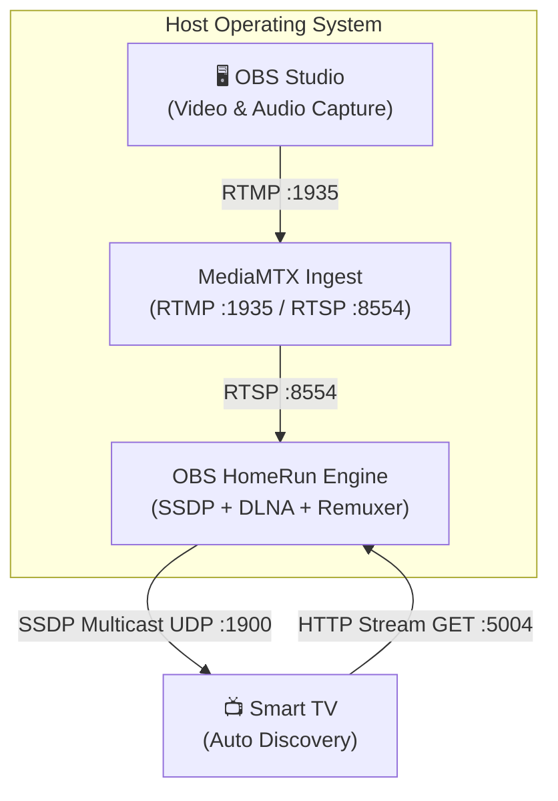

# 💻 Host OS Setup Guide: Linux, Windows, & macOS

This guide provides end-to-end setup instructions for deploying **OBS HomeRun** across **Linux**, **Windows 10/11**, **macOS (Apple Silicon & Intel)**, and **home NAS servers (Synology, TrueNAS, Unraid)**.

Whether you are a casual gamer looking for a 5-minute point-and-click walkthrough or a sysadmin configuring declarative systemd services, this guide covers every step.

---

## 📋 Table of Contents
1. [Architectural Overview & The Multicast Rule](#1-architectural-overview--the-multicast-rule)
2. [Deployment Topologies](#2-deployment-topologies)
3. [Operating System Matrix](#3-operating-system-matrix)
4. [🪟 Windows Setup Guide (Windows 10 & 11)](#4--windows-setup-guide-windows-10--11)
   - [⭐ 5-Minute Walkthrough for Non-Technical Users](#-windows-5-minute-walkthrough-for-non-technical-users)
   - [Option B: Silent Background Service (Windows Task Scheduler)](#option-b-silent-background-service-windows-task-scheduler)
   - [Option C: Windows 11 WSL2 Mirrored Mode (Docker Desktop)](#option-c-windows-11-wsl2-mirrored-mode-docker-desktop)
   - [Option D: Streaming to a Dedicated NAS / Server](#option-d-streaming-to-a-dedicated-nas--server-windows-users)
   - [Windows Firewall Configuration](#windows-firewall-configuration)
   - [Windows OBS Studio Settings](#windows-obs-studio-settings)
5. [🍎 macOS Setup Guide (Apple Silicon & Intel)](#5--macos-setup-guide-apple-silicon--intel)
   - [⭐ 5-Minute Walkthrough for Non-Technical Users](#-macos-5-minute-walkthrough-for-non-technical-users)
   - [Option B: Silent Background Service (macOS LaunchAgent `launchd`)](#option-b-silent-background-service-macos-launchagent-launchd)
   - [Option C: Streaming to a Dedicated NAS / Server](#option-c-streaming-to-a-dedicated-nas--server-mac-users)
   - [macOS Firewall & Local Network Privacy](#macos-firewall--local-network-privacy)
   - [macOS OBS Studio Settings](#macos-obs-studio-settings)
6. [🐧 Linux & Steam Deck / Bazzite Setup Guide](#6--linux--steam-deck--bazzite-setup-guide)
   - [⭐ 5-Minute Walkthrough for Bazzite / Steam Deck / Fedora](#-linux-5-minute-walkthrough-for-bazzite--steam-deck--fedora)
   - [Option B: Docker Compose / Docker CLI (`--net=host`)](#option-b-docker-compose--docker-cli-net-host)
   - [Option C: Native Binary (Standalone systemd Service)](#option-c-native-binary-standalone-systemd-service)
   - [Linux Firewall Configuration](#linux-firewall-configuration)
   - [Linux OBS Nuances (Flatpak & PipeWire)](#linux-obs-nuances)
7. [🗄️ Dedicated Home Server / NAS Setup Guide](#7-️-dedicated-home-server--nas-setup-guide)
   - [Synology NAS (Container Manager Point-and-Click Walkthrough)](#synology-nas-container-manager-point-and-click-walkthrough)
   - [Unraid & TrueNAS SCALE Setup](#unraid--truenas-scale-setup)
8. [🔍 Cross-Platform Verification & Testing](#8--cross-platform-verification--testing)

---

## 1. Architectural Overview & The Multicast Rule

To allow modern Smart TVs (Samsung Tizen, LG webOS, Sony Bravia / Google TV, Roku) to detect your stream automatically without typing IP addresses or installing TV apps, OBS HomeRun broadcasts **SSDP (Simple Service Discovery Protocol)** announcements over **UDP multicast (`239.255.255.250:1900`)**.



### ⚠️ The Multicast Rule (Why Host Networking or Native Execution is Required)
Multicast packets are strictly contained within a single Layer 2 local broadcast domain.
* **On Linux:** Docker and Podman support native host networking (`--net=host` / `network_mode: host`), allowing the container to bind directly to your physical network interface (`eth0` or `wlan0`). Multicast packets reach your home network seamlessly.
* **On Windows & macOS:** Standard Docker Desktop runs inside a virtualized hypervisor VM (WSL2 on Windows, LinuxKit on macOS) behind a virtual NAT adapter. By default, **UDP multicast packets do not cross from the container VM to the physical Wi-Fi or Ethernet adapter**. As a result, Smart TVs will not discover OBS HomeRun if it is run inside standard Docker Desktop with default NAT.
* **The Solution for Windows & macOS:** Run OBS HomeRun as a **native standalone background process**, run Docker on Windows 11 with **WSL2 mirrored networking**, or run OBS HomeRun on an **always-on NAS / Linux server** on your LAN.

---

## 2. Deployment Topologies

Choose the setup topology that fits your home setup:

### Topology 1: All-in-One (Same PC)
OBS Studio and OBS HomeRun run on the exact same computer (your gaming rig, desktop, or laptop).
* **Linux:** Run via Podman Quadlet, Docker `--net=host`, or native binary.
* **Windows:** Run natively as a portable folder / background task, or via WSL2 mirrored networking.
* **macOS:** Run natively via Homebrew + LaunchAgent.
* **Stream destination in OBS:** `rtmp://localhost:1935/live`

### Topology 2: Dedicated Home Server / NAS (Recommended for Multi-PC Homes)
OBS HomeRun runs 24/7 on an always-on NAS (Synology, TrueNAS, Unraid, QNAP) or Linux home server / mini-PC / Raspberry Pi.
* Your gaming PC (Windows), workstation (Linux), or laptop (Mac) **only runs OBS Studio**.
* Zero background containers or services need to run on your gaming machine.
* **Stream destination in OBS:** `rtmp://<NAS-IP>:1935/live` (e.g., `rtmp://192.168.1.50:1935/live`).

---

## 3. Operating System Matrix

| Feature / Requirement | 🪟 Windows 10/11 | 🍎 macOS (Apple Silicon / Intel) | 🐧 Linux & Steam Deck | 🗄️ Dedicated NAS / Server |
| :--- | :--- | :--- | :--- | :--- |
| **Recommended Deployment** | Native Portable / Service or NAS | Native LaunchAgent or NAS | Podman Quadlet or Docker `--net=host` | Docker Compose (`network_mode: host`) |
| **Container Host Network** | Requires WSL2 Mirrored mode (Win 11) | Not supported across VM bridge | Native (`--net=host`) | Native (`--net=host`) |
| **Native Standalone Option** | Native `.exe` + Task Scheduler / WinSW | Native binary + `launchd` | Native binary + systemd | Native binary |
| **Hardware Encoder in OBS** | NVENC, AMF, QuickSync | Apple VideoToolbox (VT H.264) | NVENC, VA-API, AMF | N/A (runs on client PC) |
| **Screen / Desktop Capture** | Desktop Duplication (DXGI) | ScreenCaptureKit | PipeWire Screen Capture | N/A |
| **Audio Capture** | WASAPI Desktop Audio | Desktop Audio (macOS 13+) | PipeWire Desktop Audio | N/A |
| **Firewall Inbound Ports** | UDP 1900, TCP 5004, TCP 1935 | App Firewall + Local Network Privacy | UDP 1900, TCP 5004, TCP 1935 | UDP 1900, TCP 5004, TCP 1935 |

---

## 4. 🪟 Windows Setup Guide (Windows 10 & 11)

Windows is the primary platform for gaming and streaming with OBS Studio.

---

### ⭐ Windows: 5-Minute Walkthrough for Non-Technical Users

Follow this step-by-step guide to get up and running on Windows without touching virtual machines or complex terminal commands.

#### Step 1: Install FFmpeg
OBS HomeRun uses FFmpeg to package your stream for your Smart TV.
1. Press the **Windows Key**, type **PowerShell**, and press **Enter**.
2. Type or paste the following command and press **Enter**:
   ```powershell
   winget install Gyan.FFmpeg
   ```
3. Close the PowerShell window once installation finishes.

#### Step 2: Download the Files
1. Create a new folder on your computer named `C:\OBS-HomeRun`.
2. Download the latest **MediaMTX** for Windows from [MediaMTX Releases](https://github.com/bluenviron/mediamtx/releases) (look for `mediamtx_v..._windows_amd64.zip`).
3. Extract `mediamtx.exe` from the downloaded zip file into `C:\OBS-HomeRun`.
4. Copy `obs-homerun.exe`, `mediamtx.yml`, and `start-obs-homerun.bat` into `C:\OBS-HomeRun`.

Your `C:\OBS-HomeRun` folder will contain:
```
C:\OBS-HomeRun\
├── obs-homerun.exe
├── mediamtx.exe
├── mediamtx.yml
└── start-obs-homerun.bat
```

#### Step 3: Configure Windows Firewall
Windows Defender Firewall will prompt you to allow network access. To ensure smooth TV discovery:
1. In `examples/windows/`, right-click [`setup-firewall.ps1`](file:///home/brad/source/repos/obs-homerun/examples/windows/setup-firewall.ps1) and select **Run with PowerShell** as Administrator.  
   *(Or click "Allow" on the Windows Firewall popup the first time you run the app).*

#### Step 4: Start OBS HomeRun
1. Double-click [`start-obs-homerun.bat`](file:///home/brad/source/repos/obs-homerun/examples/windows/start-obs-homerun.bat) in your `C:\OBS-HomeRun` folder.
2. A console window will open showing:
   ```
   ================================================================
                      Starting OBS HomeRun...
   ================================================================
   * Virtual HDTV Tuner is starting on port 5004
   * RTMP ingest is listening on rtmp://localhost:1935/live
   * Smart TVs on your Wi-Fi/Ethernet will discover this tuner!
   ```
3. **Leave this window open** while you want to stream to your TV. (To stop, just close the window).

#### Step 5: Configure OBS Studio
1. Open **OBS Studio**.
2. Click **Settings** (bottom right) $\rightarrow$ select **Stream** on the left:
   - **Service:** Select **Custom...**
   - **Server:** Type `rtmp://localhost:1935/live`
   - **Stream Key:** Type `stream`
3. Click **Output** on the left:
   - Set **Output Mode** to **Advanced**.
   - Under the **Streaming** tab:
     - **Video Encoder:** Select your GPU hardware encoder:
       - NVIDIA: `NVIDIA NVENC H.264`
       - AMD: `AMD HW H.264`
       - Intel: `QuickSync H.264`
     - **Rate Control:** `CBR`
     - **Bitrate:** `6000 Kbps` (or 8000–12000 Kbps if on 5GHz Wi-Fi / Ethernet)
     - **Keyframe Interval:** `1 s` *(⚠️ Critical for quick TV connection!)*
     - **Max B-frames:** `0`
4. Click **OK** to save settings.
5. In the main OBS window, click **Start Streaming**!

#### Step 6: Watch on Your Smart TV
1. Turn on your Smart TV.
2. Use your TV remote:
   - **Samsung Tizen:** Press **Source / Connected Devices** $\rightarrow$ select **OBS HomeRun** $\rightarrow$ select **Channel 1.1**.
   - **LG webOS:** Press **Source / Inputs** or open **Home Dashboard** $\rightarrow$ select **OBS HomeRun** $\rightarrow$ select **Channel 1.1**.
   - **Sony Bravia / Google TV:** Open the built-in **Media Player** app $\rightarrow$ select **OBS HomeRun** $\rightarrow$ select **Channel 1.1**.
   - **Roku TV:** Open **Roku Media Player** $\rightarrow$ select **Video** $\rightarrow$ select **OBS HomeRun** $\rightarrow$ select **Channel 1.1**.
3. Within 1–2 seconds, your PC desktop or game will appear smoothly on your TV!

---

### Option B: Silent Background Service (Windows Task Scheduler)
If you don't want to see a console window every time you use OBS HomeRun, you can have it start silently in the background whenever you log into Windows:

1. Open PowerShell as Administrator.
2. Run the provided installer script from `examples/windows/`:
   ```powershell
   powershell -ExecutionPolicy Bypass -File C:\OBS-HomeRun\install-startup-task.ps1
   ```
   *(Or run [`install-startup-task.ps1`](file:///home/brad/source/repos/obs-homerun/examples/windows/install-startup-task.ps1)).*
3. OBS HomeRun is now registered as a background task that starts automatically on logon.

---

### Option C: Windows 11 WSL2 Mirrored Mode (Docker Desktop)
If you prefer running the official container image via Docker Desktop on Windows 11 (build 22H2 or newer with WSL 2.0+):

1. Create or edit `%USERPROFILE%\.wslconfig`:
   ```ini
   [wsl2]
   networkingMode=mirrored
   firewall=true
   ```
2. Restart WSL from PowerShell:
   ```powershell
   wsl --shutdown
   ```
3. Run the container:
   ```powershell
   docker run -d --name obs-homerun --net=host ghcr.io/bradwestness/obs-homerun:latest
   ```

---

### Option D: Streaming to a Dedicated NAS / Server (Windows Users)
If you already run a home server or NAS, you do not need to install anything on your Windows PC!
1. Run the OBS HomeRun container on your NAS (see [NAS Setup Guide](#7-️-dedicated-home-server--nas-setup-guide)).
2. In OBS Studio on your Windows PC $\rightarrow$ **Settings** $\rightarrow$ **Stream**:
   - **Server:** `rtmp://<NAS-IP>:1935/live` (e.g. `rtmp://192.168.1.50:1935/live`)
   - **Stream Key:** `stream`
3. Click **Start Streaming**.

---

### Windows Firewall Configuration

To manually open ports in Windows Defender Firewall via PowerShell (run as Administrator):
```powershell
New-NetFirewallRule -DisplayName "OBS HomeRun SSDP" -Direction Inbound -Protocol UDP -LocalPort 1900 -Action Allow
New-NetFirewallRule -DisplayName "OBS HomeRun DLNA HTTP" -Direction Inbound -Protocol TCP -LocalPort 5004 -Action Allow
New-NetFirewallRule -DisplayName "OBS HomeRun RTMP Ingest" -Direction Inbound -Protocol TCP -LocalPort 1935 -Action Allow
```

---

### Windows OBS Studio Settings
* **Display Capture:** In OBS, add a **Display Capture** source. Set Capture Method to **Desktop Duplication (DXGI)** or **Windows Graphics Capture (WGC)** for hardware-accelerated 60fps capture.
* **Audio Capture:** In OBS **Settings** $\rightarrow$ **Audio**, set **Desktop Audio** to your primary speakers/headphones and ensure **Sample Rate** is **48 kHz**.
* **Ultrawide & HDR Monitors:** If you play on an ultrawide monitor (21:9 or 32:9) or with HDR enabled, check out the [OBS Studio Configuration Guide](obs-configuration.md#ultrawide-monitors-219--329) for canvas framing and virtual display drivers.

---

## 5. 🍎 macOS Setup Guide (Apple Silicon & Intel)

Broadcast your Mac desktop, creative apps, or gameplay to living room Smart TVs with Apple Silicon hardware encoding.

---

### ⭐ macOS: 5-Minute Walkthrough for Non-Technical Users

Follow this guide to get OBS HomeRun running on macOS.

#### Step 1: Install FFmpeg via Homebrew
1. Press **Command + Space**, type **Terminal**, and press **Return**.
2. If you don't already have Homebrew, install it from [brew.sh](https://brew.sh), or run:
   ```bash
   /bin/bash -c "$(curl -fsSL https://raw.githubusercontent.com/Homebrew/install/HEAD/install.sh)"
   ```
3. Install FFmpeg:
   ```bash
   brew install ffmpeg
   ```

#### Step 2: Download the Files
1. Create a folder in your Applications directory:
   ```bash
   mkdir -p ~/Applications/OBS-HomeRun && cd ~/Applications/OBS-HomeRun
   ```
2. Download MediaMTX for macOS from [MediaMTX Releases](https://github.com/bluenviron/mediamtx/releases):
   - For **Apple Silicon (M1/M2/M3/M4)**: download `mediamtx_v..._darwin_arm64.tar.gz`
   - For **Intel Macs**: download `mediamtx_v..._darwin_amd64.tar.gz`
   - Extract `mediamtx` into `~/Applications/OBS-HomeRun/`.
3. Copy `obs-homerun` and `mediamtx.yml` into `~/Applications/OBS-HomeRun/`.

#### Step 3: Run OBS HomeRun
In Terminal, navigate to the folder and launch:
```bash
cd ~/Applications/OBS-HomeRun
./obs-homerun
```
*(Leave Terminal open while streaming to your TV).*

#### Step 4: Allow macOS Security Prompts
The first time you start OBS HomeRun, macOS will display two dialog boxes:
1. **Application Firewall:** *"Do you want the application obs-homerun to accept incoming network connections?"* $\rightarrow$ Click **Allow**.
2. **Local Network Privacy (macOS 15 Sequoia / Sonoma):** *"obs-homerun would like to find devices on local networks."* $\rightarrow$ Click **Allow**.

#### Step 5: Configure OBS Studio on Mac
1. Open **OBS Studio**.
2. Go to **Settings** $\rightarrow$ **Stream**:
   - **Service:** Select **Custom...**
   - **Server:** `rtmp://localhost:1935/live`
   - **Stream Key:** `stream`
3. Go to **Settings** $\rightarrow$ **Output** (Advanced Output Mode $\rightarrow$ Streaming):
   - **Video Encoder:** Select **`Apple VT H264 Hardware Encoder`** *(0% CPU overhead on Apple Silicon)*.
   - **Rate Control:** `CBR`
   - **Bitrate:** `6000 Kbps`
   - **Keyframe Interval:** `1 s`
4. Click **OK**, then click **Start Streaming**!

#### Step 6: Watch on Your TV
Switch your TV input to **OBS HomeRun** (Channel 1.1) using your TV remote.

---

### Option B: Silent Background Service (macOS LaunchAgent `launchd`)
To have OBS HomeRun start automatically in the background whenever you log into macOS:

1. Copy the example plist file from [`examples/macos/com.bradwestness.obs-homerun.plist`](file:///home/brad/source/repos/obs-homerun/examples/macos/com.bradwestness.obs-homerun.plist) into `~/Library/LaunchAgents/`:
   ```bash
   cp examples/macos/com.bradwestness.obs-homerun.plist ~/Library/LaunchAgents/
   ```
2. Open the file and verify the path points to your `obs-homerun` binary:
   ```bash
   nano ~/Library/LaunchAgents/com.bradwestness.obs-homerun.plist
   ```
3. Load the service:
   ```bash
   launchctl load -w ~/Library/LaunchAgents/com.bradwestness.obs-homerun.plist
   ```
4. To stop or unload the service:
   ```bash
   launchctl unload ~/Library/LaunchAgents/com.bradwestness.obs-homerun.plist
   ```

---

### Option C: Streaming to a Dedicated NAS / Server (Mac Users)
If you have an always-on NAS or Linux server, run the container there and simply point OBS Studio on macOS to:
* **Server:** `rtmp://<NAS-IP>:1935/live`
* **Stream Key:** `stream`

---

### macOS Firewall & Local Network Privacy
* **Firewall:** Open **System Settings** $\rightarrow$ **Network** $\rightarrow$ **Firewall** $\rightarrow$ **Options...** and make sure `obs-homerun` and `mediamtx` are listed as allowing incoming connections.
* **Local Network:** If discovery does not work, open **System Settings** $\rightarrow$ **Privacy & Security** $\rightarrow$ **Local Network** and ensure `obs-homerun` is toggled **ON**.

---

### macOS OBS Studio Settings
* **Video Encoder:** Select **Apple VT H264 Hardware Encoder** (VideoToolbox).
* **Screen Capture:** In OBS Sources, add a **macOS Screen Capture (ScreenCaptureKit)** source.
* **Audio Capture:** In OBS 29.1+ on macOS 13 (Ventura) or newer, desktop audio is captured natively without needing virtual audio cables. In OBS **Settings** $\rightarrow$ **Audio**, set sample rate to **48 kHz**.

---

## 6. 🐧 Linux & Steam Deck / Bazzite Setup Guide

Linux provides native host networking (`--net=host`), making it the premier platform for containerized broadcasting.

---

### ⭐ Linux: 5-Minute Walkthrough for Bazzite / Steam Deck / Fedora

If you are gaming on **Bazzite**, **Steam Deck (SteamOS Desktop Mode)**, or **Fedora Silverblue**, you can set up OBS HomeRun in under 60 seconds using a Podman Quadlet:

#### Step 1: Open Terminal
Open **Terminal** (or **Konsole** on Steam Deck Desktop mode).

#### Step 2: Create the Service
Copy and paste this single command block into your terminal and press **Enter**:
```bash
mkdir -p ~/.config/containers/systemd
cat << 'EOF' > ~/.config/containers/systemd/obs-homerun.container
[Unit]
Description=OBS HomeRun - Virtual HDTV Tuner
After=network-online.target
Wants=network-online.target

[Container]
Image=ghcr.io/bradwestness/obs-homerun:latest
ContainerName=obs-homerun
Network=host
Pull=newer
AutoUpdate=registry
Environment="FRIENDLY_NAME=OBS HomeRun"
Environment=CHANNEL_NUMBER=1.1
Environment=BUFFER_SECONDS=3.0

[Install]
WantedBy=default.target
EOF

systemctl --user daemon-reload
systemctl --user start obs-homerun.service
loginctl enable-linger $USER
```

#### Step 3: Open Firewall Ports
```bash
# Fedora / Bazzite / RHEL
sudo firewall-cmd --permanent --add-port={1900/udp,5004/tcp,1935/tcp}
sudo firewall-cmd --reload
```

#### Step 4: Configure OBS Studio
1. Open OBS Studio.
2. Go to **Settings** $\rightarrow$ **Stream**:
   - **Service:** `Custom...`
   - **Server:**
     - Standard OBS: `rtmp://localhost:1935/live`
     - **Flatpak OBS:** If you installed OBS via Flatpak / Software Center, Flatpak may isolate `localhost`. Use your machine's LAN IP instead (e.g. `rtmp://192.168.1.150:1935/live`).
   - **Stream Key:** `stream`
3. Click **Start Streaming**!

#### Step 5: Watch on Your Smart TV
Select **OBS HomeRun** (Channel 1.1) in your TV's Inputs or Media menu.

---

### Option B: Docker Compose / Docker CLI (`--net=host`)
For Ubuntu, Debian, Arch Linux, or any host running Docker:

Save as `docker-compose.yml`:
```yaml
services:
  obs-homerun:
    image: ghcr.io/bradwestness/obs-homerun:latest
    container_name: obs-homerun
    network_mode: host
    restart: unless-stopped
    environment:
      - FRIENDLY_NAME=OBS HomeRun
      - CHANNEL_NUMBER=1.1
      - BUFFER_SECONDS=3.0
```

Start the container:
```bash
docker compose up -d
```

Or run via Docker CLI:
```bash
docker run -d --name obs-homerun --net=host --restart=unless-stopped ghcr.io/bradwestness/obs-homerun:latest
```

---

### Option C: Native Binary (Standalone systemd Service)
If you prefer running without container runtimes:

1. **Install FFmpeg:**
   ```bash
   sudo apt install ffmpeg   # Ubuntu / Debian
   sudo dnf install ffmpeg   # Fedora
   sudo pacman -S ffmpeg     # Arch Linux
   ```
2. **Download MediaMTX & OBS HomeRun:**
   Place `obs-homerun`, `mediamtx`, and `mediamtx.yml` into `~/.local/bin/`.
3. **Install systemd Unit:**
   Copy [`examples/linux/obs-homerun.service`](file:///home/brad/source/repos/obs-homerun/examples/linux/obs-homerun.service) into `~/.config/systemd/user/`:
   ```bash
   mkdir -p ~/.config/systemd/user
   cp examples/linux/obs-homerun.service ~/.config/systemd/user/
   systemctl --user daemon-reload
   systemctl --user enable --now obs-homerun.service
   ```

---

### Linux Firewall Configuration
Ensure UDP 1900, TCP 5004, and TCP 1935 are permitted:
* **`firewalld` (Fedora / Bazzite):**
  ```bash
  sudo firewall-cmd --permanent --add-port=1900/udp --add-port=5004/tcp --add-port=1935/tcp
  sudo firewall-cmd --reload
  ```
* **`ufw` (Ubuntu / Debian / Mint):**
  ```bash
  sudo ufw allow 1900/udp
  sudo ufw allow 5004/tcp
  sudo ufw allow 1935/tcp
  sudo ufw reload
  ```

---

### Linux OBS Nuances
* **Flatpak Sandbox:** If using Flatpak OBS Studio, `localhost` routes inside the sandbox container. Enter your PC's actual LAN IP in the OBS Server field (e.g. `rtmp://192.168.1.150:1935/live`).
* **PipeWire Desktop Capture:** Under Wayland, add a **Screen Capture (PipeWire)** source in OBS.

---

## 7. 🗄️ Dedicated Home Server / NAS Setup Guide

Running OBS HomeRun on an always-on NAS (Synology, TrueNAS, Unraid) is the most convenient option for multi-PC households. Your Smart TV will discover OBS HomeRun 24/7 without requiring any background processes on your gaming PC or Mac.

---

### Synology NAS (Container Manager Point-and-Click Walkthrough)

1. Open your Synology DSM web desktop in a browser.
2. Open **Container Manager** (or install it from the DSM Package Center).
3. In Container Manager, click **Project** on the left menu $\rightarrow$ click **Create**.
4. Fill in the project details:
   - **Project Name:** `obs-homerun`
   - **Path:** Choose any shared folder (e.g. `/docker/obs-homerun`).
   - **Source:** Select **Create docker-compose.yml**.
5. Paste the following configuration:
   ```yaml
   services:
     obs-homerun:
       image: ghcr.io/bradwestness/obs-homerun:latest
       container_name: obs-homerun
       network_mode: host
       restart: unless-stopped
       environment:
         - FRIENDLY_NAME=OBS HomeRun
         - CHANNEL_NUMBER=1.1
         - BUFFER_SECONDS=3.0
   ```
6. Click **Next** $\rightarrow$ **Next** $\rightarrow$ **Done**.
7. Container Manager will download the image and launch the service!
8. In OBS Studio on your gaming PC or Mac, set **Stream Server** to `rtmp://<SYNOLOGY-IP>:1935/live` (e.g. `rtmp://192.168.1.50:1935/live`).

---

### Unraid & TrueNAS SCALE Setup
* **Unraid:** In the Unraid WebGUI $\rightarrow$ **Docker** $\rightarrow$ **Add Container**:
  - **Name:** `obs-homerun`
  - **Repository:** `ghcr.io/bradwestness/obs-homerun:latest`
  - **Network Type:** Set to **Host** (`--net=host`).
  - Click **Apply**.
* **TrueNAS SCALE:** In TrueNAS Apps $\rightarrow$ **Launch Docker Image**:
  - Image: `ghcr.io/bradwestness/obs-homerun:latest`
  - Network: Select **Host Network**.

---

## 8. 🔍 Cross-Platform Verification & Testing

Verify that your OBS HomeRun instance is running and reachable on your local network:

### 1. Test Discovery JSON Endpoint
From any terminal (or web browser on another computer or phone):
```bash
# Linux / macOS
curl -s http://<HOST-IP>:5004/discover.json | jq .

# Windows PowerShell
(Invoke-RestMethod http://<HOST-IP>:5004/discover.json) | ConvertTo-Json
```
**Expected response:**
```json
{
  "FriendlyName": "OBS HomeRun",
  "ModelNumber": "HDTV-1.0",
  "FirmwareName": "v_atsc_tuner",
  "DeviceID": "107BDESK",
  "TunerCount": 2,
  ...
}
```

### 2. Verify Multicast Listener (Port 1900 UDP)
Ensure the host is actively listening for TV discovery requests:
```bash
# Linux
ss -u -a | grep 1900

# macOS
netstat -an -p udp | grep 1900

# Windows PowerShell
Get-NetUDPEndpoint -LocalPort 1900
```

### 3. Test Stream Playback via VLC or FFplay
Before turning on your TV, test the live stream from another PC or smartphone:
1. Click **Start Streaming** in OBS Studio.
2. Open VLC Media Player on any device:
   - **File** $\rightarrow$ **Open Network Stream...**
   - Enter: `http://<HOST-IP>:5004/auto/v1.1`
3. If video and audio begin playing cleanly within 1–2 seconds, your broadcast bridge is functioning perfectly!
4. Turn on your Smart TV—it will discover OBS HomeRun under Inputs / Sources automatically.

---

> 📖 **Related Documentation:**
> - [🎥 **Dedicated OBS Studio Configuration Guide**](obs-configuration.md)
> - [🌐 **Network Setup & Troubleshooting Guide**](network-and-troubleshooting.md)
